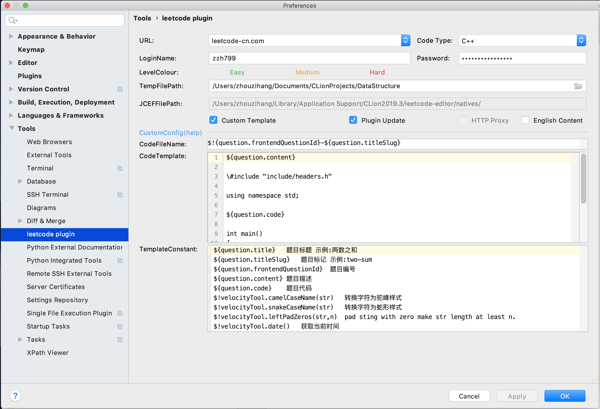
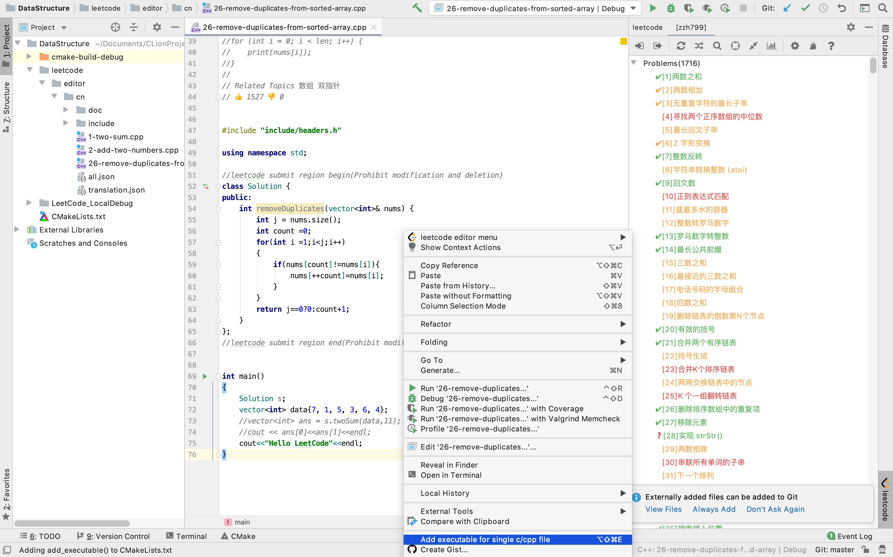

# 在Clion上调试LeetCode代码

 Debug LeetCode local in clion

参考：

[LeetCode C++ 本地调试环境](https://github.com/Pokerpoke/LeetCode)

源码：

[Git Hub地址](https://github.com/zzh799/LeetCode_LocalDebug)

## 依赖Clion插件

- [C/C+​+​ Single File Execution](https://plugins.jetbrains.com/plugin/8352-c-c--single-file-execution/)

- [leetcode editor](https://plugins.jetbrains.com/plugin/12132-leetcode-editor/)

## 使用方法

### 1.安装上述插件

打开CLion设置，在Plugins

- 搜索 ` leetcode ` 即可找到插件 `leetcode editor`，并安装。
- 搜索 ` Single File ` 即可找到插件 `C/C+​+​ Single File Execution`，并安装。

### 2.配置LeetCode插件

[LeetCode插件中文文档](https://github.com/shuzijun/leetcode-editor/blob/master/README_ZH.md)

打开 `首选项(Preferences)=>Tools=>leetcode plugin` 自行设置登录名与密码

- TempFilePath :设置到项目根目录。
- Cutstom Temlate :自定义模板，打开。
- CodeFileName :Leetcode文件名称，建议设置为`$!{question.frontendQuestionId}-${question.titleSlug}`
- CodeTemplate :重点，关系到生成的文件能否一步运行，引入了项目中的库文件，包括基本的c，c++库，与别人实现的Leetcode链表与树。

```cpp
${question.content}

\#include "include/headers.h"

using namespace std;

${question.code}

int main()
{
    Solution s;
    vector<int> data{7, 1, 5, 3, 6, 4};
    //vector<int> ans = s.twoSum(data,11);
    //cout << ans[0]<<ans[1]<<endl;
    cout<<"Hello LeetCode"<<endl;
}
```



### 3.创建Leetcode文件，并使用`C/C+​+​ Single File Execution`创建启动项目

- 打开题目列表，双击题目，生成Leetcode临时文件。
- 在文件空白处，右键选择 `Add executable for single c/cpp file`，会自动在根目录下的 `CMakeLists.txt`中创建可执行项目。

- 修改 `main()`后，运行或调试指定项目。



### 文件说明

#### include文件夹

包含了leetcode的链表与树。

#### CMakelist.txt

该项目有两个CMakelists.txt文件，一个位于根目录下，一个位于include文件夹中。

`根目录/CMakeLists.txt`:

```cmake
cmake_minimum_required(VERSION 3.9)
project(LeetCode)

set(CMAKE_CXX_STANDARD 11)

include_directories(${CMAKE_SOURCE_DIR}/include)
add_subdirectory(leetcode/editor/cn/include)

add_executable(1-two-sum leetcode/editor/cn/1-two-sum.cpp)
```

`根目录/leetcode/editor/cn/include/CMakeLists.txt`:

```cmake
aux_source_directory(. LEETCODE)
add_library(leetcode ${LEETCODE})
```
