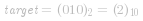
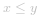

### 📺 视频题解  


### 📖 文字题解

#### 方法一：二分查找

**思路和算法**

我们定义 ![\textit{cnt}\[i\] ](./p__textit{cnt}_i__.png)  表示   数组中小于等于 *i* 的数有多少个，假设我们重复的数是  ，那么 ![\[1,\textit{target}-1\] ](./p___1,textit{target}-1__.png) 里的所有数满足 ![\textit{cnt}\[i\]\lei ](./p__textit{cnt}_i_le_i_.png) ，*[target,n]* 里的所有数满足 ![\textit{cnt}\[i\]>i ](./p__textit{cnt}_i__i_.png) ，具有单调性。

以示例 1 为例，我们列出每个数字的   值：

nums | 1 | 2 | 3 | 4
:-: | :-: | :-: | :-: | :-:
cnt | 1 | 3 | 4 | 5 

示例中重复的整数是 *2*，我们可以看到 *[1,1]* 中的数满足 ![\textit{cnt}\[i\]\lei ](./p__textit{cnt}_i_le_i_.png) ，*[2,4]* 中的数满足 ![\textit{cnt}\[i\]>i ](./p__textit{cnt}_i__i_.png)  。

如果知道 ![\textit{cnt}\[\] ](./p__textit{cnt}___.png)  数组随数字 *i* 逐渐增大具有单调性（即   前 ![\textit{cnt}\[i\]\lei ](./p__textit{cnt}_i_le_i_.png) ，  后 ![\textit{cnt}\[i\]>i ](./p__textit{cnt}_i__i_.png) ），那么我们就可以直接利用二分查找来找到重复的数。

但这个性质一定是正确的吗？考虑   数组一共有 *n+1* 个位置，我们填入的数字都在 *[1,n]* 间，有且只有一个数重复放了两次以上。对于所有测试用例，考虑以下两种情况：

- 如果测试用例的数组中   出现了两次，其余的数各出现了一次，这个时候肯定满足上文提及的性质，因为小于   的数 *i* 满足 ![\textit{cnt}\[i\]=i ](./p__textit{cnt}_i_=i_.png) ，大于等于   的数 *j* 满足 *cnt[j]=j+1*。

- 如果测试用例的数组中   出现了三次及以上，那么必然有一些数不在   数组中了，这个时候相当于我们用   去替换了这些数，我们考虑替换的时候对 ![\textit{cnt}\[\] ](./p__textit{cnt}___.png)  数组的影响。如果替换的数 *i* 小于   ，那么 ![\[i,\textit{target}-1\] ](./p___i,_textit{target}-1__.png)  的   值均减一，其他不变，满足条件。如果替换的数 *j* 大于等于  ，那么 ![\[\textit{target},j-1\] ](./p___textit{target},_j-1__.png)  的   值均加一，其他不变，亦满足条件。

因此我们生成的数组一定具有上述性质的。

```C++ [sol1-C++]
class Solution {
public:
    int findDuplicate(vector<int>& nums) {
        int n = nums.size();
        int l = 1, r = n - 1, ans = -1;
        while (l <= r) {
            int mid = (l + r) >> 1;
            int cnt = 0;
            for (int i = 0; i < n; ++i) {
                cnt += nums[i] <= mid;
            }
            if (cnt <= mid) {
                l = mid + 1;
            } else {
                r = mid - 1;
                ans = mid;
            }
        }
        return ans;
    }
};
```

```JavaScript [sol1-JavaScript]
var findDuplicate = function(nums) {
    const n = nums.length;
    let l = 1, r = n - 1, ans = -1;
    while (l <= r) {
        let mid = (l + r) >> 1;
        let cnt = 0;
        for (let i = 0; i < n; ++i) {
            cnt += nums[i] <= mid;
        }
        if (cnt <= mid) {
            l = mid + 1;
        } else {
            r = mid - 1;
            ans = mid;
        }
    }
    return ans;
};
```

```Java [sol1-Java]
class Solution {
    public int findDuplicate(int[] nums) {
        int n = nums.length;
        int l = 1, r = n - 1, ans = -1;
        while (l <= r) {
            int mid = (l + r) >> 1;
            int cnt = 0;
            for (int i = 0; i < n; ++i) {
                if (nums[i] <= mid) {
                    cnt++;
                }
            }
            if (cnt <= mid) {
                l = mid + 1;
            } else {
                r = mid - 1;
                ans = mid;
            }
        }
        return ans;
    }
}
```

```golang [sol1-Golang]
func findDuplicate(nums []int) int {
    n := len(nums)
    l, r := 1, n - 1
    ans := -1
    for l <= r {
        mid := (l + r) >> 1
        cnt := 0
        for i := 0; i < n; i++ {
            if nums[i] <= mid {
                cnt++
            }
        }
        if cnt <= mid {
            l = mid + 1
        } else {
            r = mid - 1
            ans = mid
        }
    }
    return ans
}
```

**复杂度分析**

- 时间复杂度： ，其中 *n* 为   数组的长度。二分查找最多需要二分   次，每次判断的时候需要*O(n)* 遍历   数组求解小于等于   的数的个数，因此总时间复杂度为  。
- 空间复杂度：*O(1)*。我们只需要常数空间存放若干变量。

#### 方法二：二进制

**思路和算法**

这个方法我们来将所有数二进制展开按位考虑如何找出重复的数，如果我们能确定重复数每一位是 *1* 还是 *0* 就可以按位还原出重复的数是什么。

考虑到第 *i* 位，我们记   数组中二进制展开后第 *i* 位为 *1* 的数有 *x* 个，数字 *[1,n]* 这 *n* 个数二进制展开后第 *i* 位为 *1* 的数有 *y* 个，那么重复的数第 *i* 位为 *1* 当且仅当 *x>y*。

仍然以示例 1 为例，如下的表格列出了每个数字二进制下每一位是 *1* 还是 *0* 以及对应位的 *x* 和 *y* 是多少：

&nbsp; | 1 | 3 | 4 | 2 | 2 | x | y
:-: | :-: | :-: | :-: | :-: |  :-: | :-: | :-:
第 0 位 | 1 | 1 | 0 | 0 | 0 | 2 | 2 
第 1 位 | 0 | 1 | 0 | 1 | 1 | 3 | 2 
第 2 位 | 0 | 0 | 1 | 0 | 0 | 1 | 1 

那么按之前说的我们发现只有第 *1* 位 *x>y* ，所以按位还原后  ，符合答案。

正确性的证明其实和方法一类似，我们可以按方法一的方法，考虑不同示例数组中第 *i* 位 *1* 的个数 *x* 的变化：

- 如果测试用例的数组中   出现了两次，其余的数各出现了一次，且   的第 *i* 位为 *1*，那么   数组中第 *i* 位 *1* 的个数 *x* 恰好比  *y* 大一。如果  的第 *i* 位为 *0*，那么两者相等。
- 如果测试用例的数组中   出现了三次及以上，那么必然有一些数不在   数组中了，这个时候相当于我们用   去替换了这些数，我们考虑替换的时候对 *x* 的影响：
   - 如果被替换的数第 *i* 位为 *1*，且   第 *i* 位为 *1*：*x* 不变，满足 *x>y*。
   - 如果被替换的数第 *i* 位为 *0*，且   第 *i* 位为 *1*：*x* 加一，满足 *x>y*。
   - 如果被替换的数第 *i* 位为 *1*，且   第 *i* 位为 *0*：*x* 减一，满足  。
   - 如果被替换的数第 *i* 位为 *0*，且   第 *i* 位为 *0*：*x* 不变，满足  。

也就是说如果   第 *i* 位为 *1*，那么每次替换后只会使 *x* 不变或增大，如果为 *0*，只会使 *x* 不变或减小，始终满足 *x>y* 时   第 *i* 位为 *1*，否则为 *0*，因此我们只要按位还原这个重复的数即可。

```C++ [sol2-C++]
class Solution {
public:
    int findDuplicate(vector<int>& nums) {
        int n = nums.size(), ans = 0;
        // 确定二进制下最高位是多少
        int bit_max = 31;
        while (!((n - 1) >> bit_max)) {
            bit_max -= 1;
        }
        for (int bit = 0; bit <= bit_max; ++bit) {
            int x = 0, y = 0;
            for (int i = 0; i < n; ++i) {
                if (nums[i] & (1 << bit)) {
                    x += 1;
                }
                if (i >= 1 && (i & (1 << bit))) {
                    y += 1;
                }
            }
            if (x > y) {
                ans |= 1 << bit;
            }
        }
        return ans;
    }
};
```

```JavaScript [sol2-JavaScript]
var findDuplicate = function(nums) {
    const n = nums.length;
    let ans = 0;
    // 确定二进制下最高位是多少
    let bit_max = 31;
    while (!((n - 1) >> bit_max)) {
        bit_max -= 1;
    }
    for (let bit = 0; bit <= bit_max; ++bit) {
        let x = 0, y = 0;
        for (let i = 0; i < n; ++i) {
            if (nums[i] & (1 << bit)) {
                x += 1;
            }
            if (i >= 1 && (i & (1 << bit))) {
                y += 1;
            }
        }
        if (x > y) {
            ans |= 1 << bit;
        }
    }
    return ans;
};
```

```Java [sol2-Java]
class Solution {
    public int findDuplicate(int[] nums) {
        int n = nums.length, ans = 0;
        int bit_max = 31;
        while (((n - 1) >> bit_max) == 0) {
            bit_max -= 1;
        }
        for (int bit = 0; bit <= bit_max; ++bit) {
            int x = 0, y = 0;
            for (int i = 0; i < n; ++i) {
                if ((nums[i] & (1 << bit)) != 0) {
                    x += 1;
                }
                if (i >= 1 && ((i & (1 << bit)) != 0)) {
                    y += 1;
                }
            }
            if (x > y) {
                ans |= 1 << bit;
            }
        }
        return ans;
    }
}
```

```golang [sol2-Golang]
func findDuplicate(nums []int) int {
    n := len(nums)
    ans := 0
    bit_max := 31
    for ((n-1) >> bit_max) == 0 {
        bit_max--
    }
    for bit := 0; bit <= bit_max; bit++ {
        x, y := 0, 0
        for i := 0; i < n; i++ {
            if (nums[i] & (1 << bit)) > 0 {
                x++
            }
            if i >= 1 && (i & (1 << bit)) > 0 {
                y++
            }
        }
        if x > y {
            ans |= 1 << bit
        }
    }
    return ans
}
```

**复杂度证明**

- 时间复杂度： ，其中 *n* 为   数组的长度。  代表了我们枚举二进制数的位数个数，枚举第 *i* 位的时候需要遍历数组统计 *x* 和 *y* 的答案，因此总时间复杂度为  。

- 空间复杂度：*O(1)*。我们只需要常数空间存放若干变量。

#### 方法三：快慢指针

**预备知识**

本方法需要读者对 「Floyd 判圈算法」（又称龟兔赛跑算法）有所了解，它是一个检测链表是否有环的算法，LeetCode 中相关例题有 [141. 环形链表](https://leetcode-cn.com/problems/linked-list-cycle/)，[142. 环形链表 II](https://leetcode-cn.com/problems/linked-list-cycle-ii/solution/huan-xing-lian-biao-ii-by-leetcode/)。

**思路和算法**

我们对   数组建图，每个位置 *i* 连一条 ![i\rightarrow\textit{nums}\[i\] ](./p__irightarrow_textit{nums}_i__.png)  的边。由于存在的重复的数字  ，因此   这个位置一定有起码两条指向它的边，因此整张图一定存在环，且我们要找到的   就是这个环的入口，那么整个问题就等价于 [142. 环形链表 II](https://leetcode-cn.com/problems/linked-list-cycle-ii/solution/huan-xing-lian-biao-ii-by-leetcode/)。

我们先设置慢指针   和快指针   ，慢指针每次走一步，快指针每次走两步，根据「Floyd 判圈算法」两个指针在有环的情况下一定会相遇，此时我们再将   放置起点 *0*，两个指针每次同时移动一步，相遇的点就是答案。

                          

这里简单解释为什么后面将   放置起点后移动相遇的点就一定是答案了。假设环长为 *L*，从起点到环的入口的步数是 *a*，从环的入口继续走 *b* 步到达相遇位置，从相遇位置继续走 *c* 步回到环的入口，则有 *b+c=L*，其中 *L*、*a*、*b*、*c* 都是正整数。根据上述定义，慢指针走了 *a+b* 步，快指针走了 *2(a+b)* 步。从另一个角度考虑，在相遇位置，快指针比慢指针多走了若干圈，因此快指针走的步数还可以表示成 *a+b+kL*，其中 *k* 表示快指针在环上走的圈数。联立等式，可以得到
*
2(a+b)=a+b+kL
*
解得 *a=kL-b*，整理可得
*
a=(k-1)L+(L-b)=(k-1)L+c
*
从上述等式可知，如果慢指针从起点出发，快指针从相遇位置出发，每次两个指针都移动一步，则慢指针走了 *a* 步之后到达环的入口，快指针在环里走了 *k-1* 圈之后又走了 *c* 步，由于从相遇位置继续走 *c* 步即可回到环的入口，因此快指针也到达环的入口。两个指针在环的入口相遇，相遇点就是答案。

```C++ [sol3-C++]
class Solution {
public:
    int findDuplicate(vector<int>& nums) {
        int slow = 0, fast = 0;
        do {
            slow = nums[slow];
            fast = nums[nums[fast]];
        } while (slow != fast);
        slow = 0;
        while (slow != fast) {
            slow = nums[slow];
            fast = nums[fast];
        }
        return slow;
    }
};
```

```JavaScript [sol3-JavaScript]
var findDuplicate = function(nums) {
    let slow = 0, fast = 0;
    do {
        slow = nums[slow];
        fast = nums[nums[fast]];
    } while (slow != fast);
    slow = 0;
    while (slow != fast) {
        slow = nums[slow];
        fast = nums[fast];
    }
    return slow;
};
```

```Java [sol3-Java]
class Solution {
    public int findDuplicate(int[] nums) {
        int slow = 0, fast = 0;
        do {
            slow = nums[slow];
            fast = nums[nums[fast]];
        } while (slow != fast);
        slow = 0;
        while (slow != fast) {
            slow = nums[slow];
            fast = nums[fast];
        }
        return slow;
    }
}
```

```golang [sol3-Golang]
func findDuplicate(nums []int) int {
    slow, fast := 0, 0
    for slow, fast = nums[slow], nums[nums[fast]]; slow != fast; slow, fast = nums[slow], nums[nums[fast]] { }
    slow = 0
    for slow != fast {
        slow = nums[slow]
        fast = nums[fast]
    }
    return slow
}
```

**复杂度分析**

- 时间复杂度：*O(n)*。「Floyd 判圈算法」时间复杂度为线性的时间复杂度。

- 空间复杂度：*O(1)*。我们只需要常数空间存放若干变量。