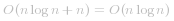
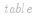
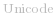
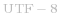
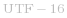

#### 方法一：排序

*t* 是 *s* 的异位词等价于「两个字符串排序后相等」。因此我们可以对字符串 *s* 和 *t* 分别排序，看排序后的字符串是否相等即可判断。此外，如果 *s* 和 *t* 的长度不同，*t* 必然不是 *s* 的异位词。

```Java [sol1-Java]
class Solution {
    public boolean isAnagram(String s, String t) {
        if (s.length() != t.length()) {
            return false;
        }
        char[] str1 = s.toCharArray();
        char[] str2 = t.toCharArray();
        Arrays.sort(str1);
        Arrays.sort(str2);
        return Arrays.equals(str1, str2);
    }
}
```

```JavaScript [sol1-JavaScript]
var isAnagram = function(s, t) {
    return s.length == t.length && [...s].sort().join('') === [...t].sort().join('')
};
```

```C++ [sol1-C++]
class Solution {
public:
    bool isAnagram(string s, string t) {
        if (s.length() != t.length()) {
            return false;
        }
        sort(s.begin(), s.end());
        sort(t.begin(), t.end());
        return s == t;
    }
};
```

```Golang [sol1-Golang]
func isAnagram(s, t string) bool {
    s1, s2 := []byte(s), []byte(t)
    sort.Slice(s1, func(i, j int) bool { return s1[i] < s1[j] })
    sort.Slice(s2, func(i, j int) bool { return s2[i] < s2[j] })
    return string(s1) == string(s2)
}
```

```C [sol1-C]
int cmp(const void* _a, const void* _b) {
    char a = *(char*)_a, b = *(char*)_b;
    return a - b;
}

bool isAnagram(char* s, char* t) {
    int len_s = strlen(s), len_t = strlen(t);
    if (len_s != len_t) {
        return false;
    }
    qsort(s, len_s, sizeof(char), cmp);
    qsort(t, len_t, sizeof(char), cmp);
    return strcmp(s, t) == 0;
}
```

**复杂度分析**

* 时间复杂度： ，其中 *n* 为 *s* 的长度。排序的时间复杂度为  ，比较两个字符串是否相等时间复杂度为 *O(n)*，因此总体时间复杂度为  。

* 空间复杂度： 。排序需要   的空间复杂度。注意，在某些语言（比如 Java & JavaScript）中字符串是不可变的，因此我们需要额外的 *O(n)* 的空间来拷贝字符串。但是我们忽略这一复杂度分析，因为：
   * 这依赖于语言的细节；
   * 这取决于函数的设计方式，例如，可以将函数参数类型更改为 `char[]`。

#### 方法二：哈希表

从另一个角度考虑，*t* 是 *s* 的异位词等价于「两个字符串中字符出现的种类和次数均相等」。由于字符串只包含 *26* 个小写字母，因此我们可以维护一个长度为 *26* 的频次数组  ，先遍历记录字符串 *s* 中字符出现的频次，然后遍历字符串 *t*，减去   中对应的频次，如果出现 ![\textit{table}\[i\]<0 ](./p__textit{table}_i__0_.png) ，则说明 *t* 包含一个不在 *s* 中的额外字符，返回   即可。

```Java [sol2-Java]
class Solution {
    public boolean isAnagram(String s, String t) {
        if (s.length() != t.length()) {
            return false;
        }
        int[] table = new int[26];
        for (int i = 0; i < s.length(); i++) {
            table[s.charAt(i) - 'a']++;
        }
        for (int i = 0; i < t.length(); i++) {
            table[t.charAt(i) - 'a']--;
            if (table[t.charAt(i) - 'a'] < 0) {
                return false;
            }
        }
        return true;
    }
}
```

```JavaScript [sol2-JavaScript]
var isAnagram = function(s, t) {
    if (s.length !== t.length) {
        return false;
    }
    const table = new Array(26).fill(0);
    for (let i = 0; i < s.length; ++i) {
        table[s.codePointAt(i) - 'a'.codePointAt(0)]++;
    }
    for (let i = 0; i < t.length; ++i) {
        table[t.codePointAt(i) - 'a'.codePointAt(0)]--;
        if (table[t.codePointAt(i) - 'a'.codePointAt(0)] < 0) {
            return false;
        }
    }
    return true;
};
```

```C++ [sol2-C++]
class Solution {
public:
    bool isAnagram(string s, string t) {
        if (s.length() != t.length()) {
            return false;
        }
        vector<int> table(26, 0);
        for (auto& ch: s) {
            table[ch - 'a']++;
        }
        for (auto& ch: t) {
            table[ch - 'a']--;
            if (table[ch - 'a'] < 0) {
                return false;
            }
        }
        return true;
    }
};
```

```Golang [sol2-Golang]
func isAnagram(s, t string) bool {
    var c1, c2 [26]int
    for _, ch := range s {
        c1[ch-'a']++
    }
    for _, ch := range t {
        c2[ch-'a']++
    }
    return c1 == c2
}
```

```C [sol2-C]
bool isAnagram(char* s, char* t) {
    int len_s = strlen(s), len_t = strlen(t);
    if (len_s != len_t) {
        return false;
    }
    int table[26];
    memset(table, 0, sizeof(table));
    for (int i = 0; i < len_s; ++i) {
        table[s[i] - 'a']++;
    }
    for (int i = 0; i < len_t; ++i) {
        table[t[i] - 'a']--;
        if (table[t[i] - 'a'] < 0) {
            return false;
        }
    }
    return true;
}
```

对于进阶问题，  是为了解决传统字符编码的局限性而产生的方案，它为每个语言中的字符规定了一个唯一的二进制编码。而   中可能存在一个字符对应多个字节的问题，为了让计算机知道多少字节表示一个字符，面向传输的编码方式的   和   也随之诞生逐渐广泛使用，具体相关的知识读者可以继续查阅相关资料拓展视野，这里不再展开。

回到本题，进阶问题的核心点在于「字符是离散未知的」，因此我们用哈希表维护对应字符的频次即可。同时读者需要注意   一个字符可能对应多个字节的问题，不同语言对于字符串读取处理的方式是不同的。

```Java [sol3-Java]
class Solution {
    public boolean isAnagram(String s, String t) {
        if (s.length() != t.length()) {
            return false;
        }
        Map<Character, Integer> table = new HashMap<Character, Integer>();
        for (int i = 0; i < s.length(); i++) {
            char ch = s.charAt(i);
            table.put(ch, table.getOrDefault(ch, 0) + 1);
        }
        for (int i = 0; i < t.length(); i++) {
            char ch = t.charAt(i);
            table.put(ch, table.getOrDefault(ch, 0) - 1);
            if (table.get(ch) < 0) {
                return false;
            }
        }
        return true;
    }
}
```

```Golang [sol3-Golang]
func isAnagram(s, t string) bool {
    if len(s) != len(t) {
        return false
    }
    cnt := map[rune]int{}
    for _, ch := range s {
        cnt[ch]++
    }
    for _, ch := range t {
        cnt[ch]--
        if cnt[ch] < 0 {
            return false
        }
    }
    return true
}
```

**复杂度分析**

* 时间复杂度：*O(n)*，其中 *n* 为 *s* 的长度。

* 空间复杂度：*O(S)*，其中 *S* 为字符集大小，此处 *S=26*。