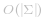
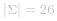

#### 方法一：计数

首先遍历字符串 *s*，对其中的每个字符都将计数值加 *1*；然后遍历字符串 *t*，对其中的每个字符都将计数值减 *1*。当发现某个字符计数值为负数时，说明该字符在字符串 *t* 中出现的次数大于在字符串 *s* 中出现的次数，因此该字符为被添加的字符。

```C++ [sol1-C++]
class Solution {
public:
    char findTheDifference(string s, string t) {
        vector<int> cnt(26, 0);
        for (char ch: s) {
            cnt[ch - 'a']++;
        }
        for (char ch: t) {
            cnt[ch - 'a']--;
            if (cnt[ch - 'a'] < 0) {
                return ch;
            }
        }
        return ' ';
    }
};
```

```Java [sol1-Java]
class Solution {
    public char findTheDifference(String s, String t) {
        int[] cnt = new int[26];
        for (int i = 0; i < s.length(); ++i) {
            char ch = s.charAt(i);
            cnt[ch - 'a']++;
        }
        for (int i = 0; i < t.length(); ++i) {
            char ch = t.charAt(i);
            cnt[ch - 'a']--;
            if (cnt[ch - 'a'] < 0) {
                return ch;
            }
        }
        return ' ';
    }
}
```

```Go [sol1-Golang]
func findTheDifference(s, t string) byte {
    cnt := [26]int{}
    for _, ch := range s {
        cnt[ch-'a']++
    }
    for i := 0; ; i++ {
        ch := t[i]
        cnt[ch-'a']--
        if cnt[ch-'a'] < 0 {
            return ch
        }
    }
}
```

```JavaScript [sol1-JavaScript]
var findTheDifference = function(s, t) {
    const cnt = new Array(26).fill(0);
    for (const ch of s) {
        cnt[ch.charCodeAt() - 'a'.charCodeAt()]++;
    }
    for (const ch of t) {
        cnt[ch.charCodeAt() - 'a'.charCodeAt()]--;
        if (cnt[ch.charCodeAt() - 'a'.charCodeAt()] < 0) {
            return ch;
        }
    }
    return ' ';
};
```

```C [sol1-C]
char findTheDifference(char* s, char* t) {
    int cnt[26];
    memset(cnt, 0, sizeof(cnt));
    int n = strlen(s), m = strlen(t);
    for (int i = 0; i < n; i++) {
        cnt[s[i] - 'a']++;
    }
    for (int i = 0; i < m; i++) {
        cnt[t[i] - 'a']--;
        if (cnt[t[i] - 'a'] < 0) {
            return t[i];
        }
    }
    return ' ';
}
```

**复杂度分析**

- 时间复杂度：*O(N)*，其中 *N* 为字符串的长度。

- 空间复杂度： ，其中   是字符集，这道题中字符串只包含小写字母， 。需要使用数组对每个字符计数。

#### 方法二：求和

将字符串 *s* 中每个字符的 ASCII 码的值求和，得到 *A_s*；对字符串 *t* 同样的方法得到 *A_t*。两者的差值 *A_t-A_s* 即代表了被添加的字符。

```C++ [sol2-C++]
class Solution {
public:
    char findTheDifference(string s, string t) {
        int as = 0, at = 0;
        for (char ch: s) {
            as += ch;
        }
        for (char ch: t) {
            at += ch;
        }
        return at - as;
    }
};
```

```Java [sol2-Java]
class Solution {
    public char findTheDifference(String s, String t) {
        int as = 0, at = 0;
        for (int i = 0; i < s.length(); ++i) {
            as += s.charAt(i);
        }
        for (int i = 0; i < t.length(); ++i) {
            at += t.charAt(i);
        }
        return (char) (at - as);
    }
}
```

```Go [sol2-Golang]
func findTheDifference(s, t string) byte {
    query := 0
    for _, ch := range s {
        query -= int(ch)
    }
    for _, ch := range t {
        query += int(ch)
    }
    return byte(query)
}
```

```JavaScript [sol2-JavaScript]
var findTheDifference = function(s, t) {
    let as = 0, at = 0;
    for (let i = 0; i < s.length; i++) {
        as += s[i].charCodeAt();
    }
    for (let i = 0; i < t.length; i++) {
        at += t[i].charCodeAt();
    }
    return String.fromCharCode(at - as);
};
```

```C [sol2-C]
char findTheDifference(char* s, char* t) {
    int n = strlen(s), m = strlen(t);
    int as = 0, at = 0;
    for (int i = 0; i < n; i++) {
        as += s[i];
    }
    for (int i = 0; i < m; i++) {
        at += t[i];
    }
    return at - as;
}
```

**复杂度分析**

- 时间复杂度：*O(N)*。

- 空间复杂度：*O(1)*。

#### 方法三：位运算

如果将两个字符串拼接成一个字符串，则问题转换成求字符串中出现奇数次的字符。类似于「[136. 只出现一次的数字](https://leetcode-cn.com/problems/single-number/)」，我们使用位运算的技巧解决本题。

```C++ [sol3-C++]
class Solution {
public:
    char findTheDifference(string s, string t) {
        int ret = 0;
        for (char ch: s) {
            ret ^= ch;
        }
        for (char ch: t) {
            ret ^= ch;
        }
        return ret;
    }
};
```

```Java [sol3-Java]
class Solution {
    public char findTheDifference(String s, String t) {
        int ret = 0;
        for (int i = 0; i < s.length(); ++i) {
            ret ^= s.charAt(i);
        }
        for (int i = 0; i < t.length(); ++i) {
            ret ^= t.charAt(i);
        }
        return (char) ret;
    }
}
```

```Go [sol3-Golang]
func findTheDifference(s, t string) (diff byte) {
    for i := range s {
        diff ^= s[i] ^ t[i]
    }
    return diff ^ t[len(t)-1]
}
```

```JavaScript [sol3-JavaScript]
var findTheDifference = function(s, t) {
    let ret = 0;
    for (const ch of s) {
        ret ^= ch.charCodeAt();
    }
    for (const ch of t) {
        ret ^= ch.charCodeAt();
    }
    return String.fromCharCode(ret);
};
```

```C [sol3-C]
char findTheDifference(char* s, char* t) {
    int n = strlen(s), m = strlen(t);
    int ret = 0;
    for (int i = 0; i < n; i++) {
        ret ^= s[i];
    }
    for (int i = 0; i < m; i++) {
        ret ^= t[i];
    }
    return ret;
}
```

**复杂度分析**

- 时间复杂度：*O(N)*。

- 空间复杂度：*O(1)*。